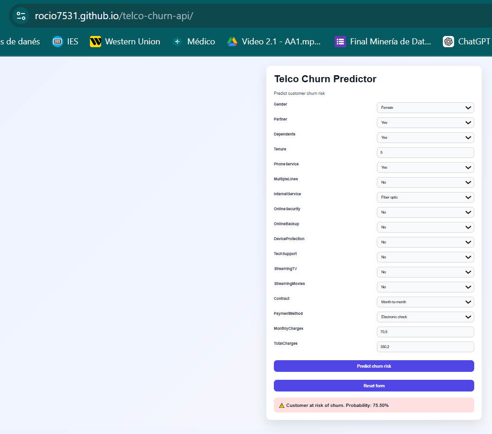

# 📊 Telco Churn Predictor

A web application that predicts customer churn risk using a machine learning model.

## 🌐 Live Demo

👉 https://rocio7531.github.io/telco-churn-api/

---

## 🚀 Overview

This project allows users to input customer data and receive a prediction of whether the customer is likely to churn, along with a probability score.

The application combines:
- A **FastAPI backend** (deployed on Render)
- A **JavaScript frontend** (hosted on GitHub Pages)
- A **scikit-learn model** for churn prediction

---

## 🧠 Features

- Predict customer churn risk in real time
- Probability score output
- Clean and user-friendly UI
- Form validation through controlled inputs
- Reset form functionality
- Error handling (API connection, server errors)

---

## 🛠️ Tech Stack

- **Backend:** FastAPI (Python)
- **Frontend:** HTML, CSS, JavaScript
- **Machine Learning:** scikit-learn
- **Deployment:** Render (API) + GitHub Pages (frontend)

---

## 📡 API

### Endpoint

POST /predict


### Request body (JSON)

Example:

```json
{
  "gender": "Female",
  "Partner": "Yes",
  "Dependents": "Yes",
  "tenure": 5,
  "PhoneService": "Yes",
  "MultipleLines": "No",
  "InternetService": "DSL",
  "OnlineSecurity": "No",
  "OnlineBackup": "Yes",
  "DeviceProtection": "No",
  "TechSupport": "No",
  "StreamingTV": "No",
  "StreamingMovies": "No",
  "Contract": "Month-to-month",
  "PaymentMethod": "Electronic check",
  "MonthlyCharges": 70.5,
  "TotalCharges": 350.2
}
```

### Response

```json
{
  "prediction": 1,
  "churn_probability": 0.755
}
```

## ⚙️ Local Setup
1. Clone the repository

git clone https://github.com/Rocio7531/telco-churn-api.git

2. Create virtual environment

python -m venv .venv
source .venv/bin/activate  # (Linux/Mac)
.venv\Scripts\activate     # (Windows)

3. Install dependencies

pip install -r requirements.txt

4. Run the API

uvicorn main:app --reload

5. Open frontend

Open index.html in your browser.


🔐 Notes

Environment variables (e.g. API keys) are not exposed in the frontend
CORS is configured to allow requests from GitHub Pages

📈 Future Improvements

Add model explainability (feature importance)
Improve UI with charts/visual feedback
Add authentication layer
Support batch predictions

## 📸 Preview



## 🧠 Model

The model is a classification algorithm trained on the Telco Customer Churn dataset.  
It outputs the probability of a customer churning based on service usage, contract type, and billing features.

👩‍💻 Author

Rocío Yut

Data Science / Machine Learning Project